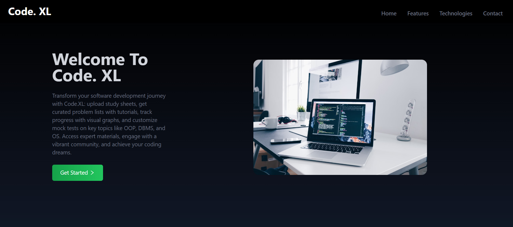
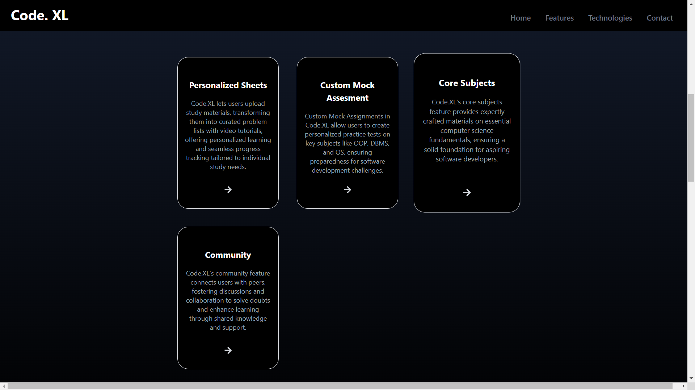

# Code.XL

## Overview

Code.XL is an innovative web app designed to help students prepare for a career in software development. It offers a comprehensive suite of features tailored to enhance learning and ensure readiness for real-world challenges in the tech industry. With Code.XL, users can personalize their study plans and track their progress through intuitive visual graphs, allowing them to visualize their learning journey. This functionality helps users identify strengths and areas for improvement, empowering them to focus their efforts effectively. Additionally, the app fosters engagement with a vibrant community of learners, providing a supportive environment for collaboration and knowledge sharing.

## Architecture

Code.XL consists of two main components:
- **Frontend**: The user interface, built using modern web technologies.
- **Backend**: The server-side logic that handles data processing and storage.

## Key Features

### Personalized Sheets
- **Upload and Transform**: Upload SDE sheets in Excel format, which are then transformed into problem lists with accompanying YouTube video tutorials.
- **Progress Tracking**: Effortlessly track your progress with visual graphs that provide clear insights into your learning journey.

### Custom Mock Assignments
- **Tailored Practice Tests**: Create personalized mock tests on key subjects such as Object-Oriented Programming (OOP), Database Management Systems (DBMS), Operating Systems (OS), and Aptitude.
- **Assessment and Readiness**: These custom tests help assess your understanding and ensure you are well-prepared for software development challenges.

### Core Concepts Archive
- **Expertly Crafted Materials**: Access in-depth materials on essential topics like Operating Systems, OOP, DBMS, and other core computer science subjects.
- **Strong Foundation**: Build a solid foundation in computer science fundamentals, essential for excelling in software development.

### Community Feature
- **Collaborative Learning**: Connect with peers to discuss and resolve doubts, share knowledge, and support each other's progress.
- **Vibrant Community**: Engage with a community of learners, promoting collaborative learning and mutual growth.

## Screenshots

  <!-- Ensure this path is correct -->
  <!-- Ensure this path is correct -->

## Video Demo

Watch our video demo to see Code.XL in action: [Video Demo Link](https://drive.google.com/file/d/1ivNQrtOYQaofHKUEowIwtOstiGGktADP/view?usp=sharing)

## Getting Started

1. **Visit the Website**: Access Code.XL through our web app at [https://code-xl.vercel.app/].
2. **Create an Account**: Sign up and create your personal profile.
3. **Upload Study Sheets**: Begin by uploading your study materials in Excel format.
4. **Explore Features**: Dive into the various features like personalized sheets, custom mock assignments, and the core concepts archive.
5. **Join the Community**: Engage with the community to enhance your learning experience.

## Support

For any queries or support, reach out to our support team at [tirthamunai1234@gmail.com](mailto:tirthamunai1234@gmail.com).

## License

Code.XL is licensed under the MIT License. See the LICENSE file for more details.

---

Thank you for choosing Code.XL. We hope it transforms your learning journey and helps you achieve your software development dreams!
